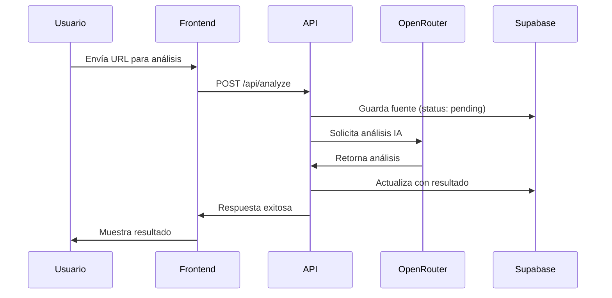
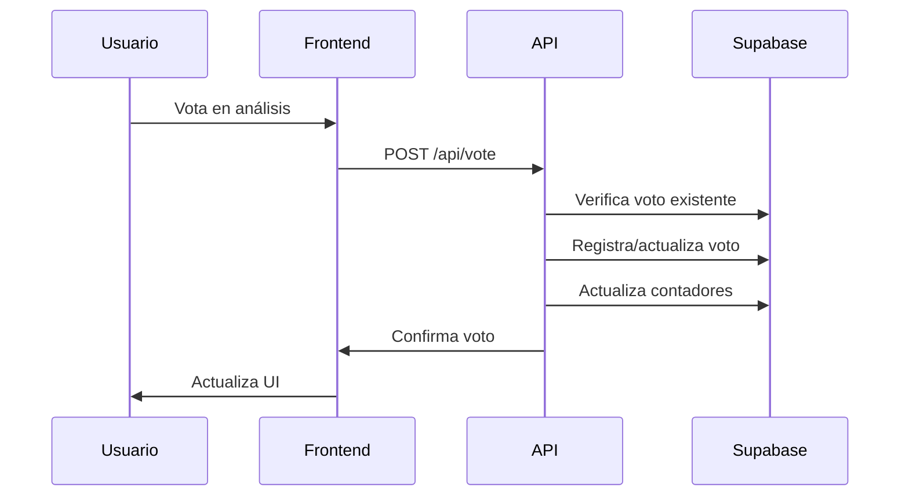

# Arquitectura del Sistema PoliCheck

## 📋 Información General

**Proyecto**: PoliCheck - Plataforma de Análisis Político con IA  
**Versión**: 1.0.0  
**Fecha**: Enero 2025  
**Stack**: Next.js 15, TypeScript, Supabase, OpenRouter  

---

## 🏗️ Arquitectura General

### Diagrama de Alto Nivel
```
┌─────────────────┐    ┌─────────────────┐    ┌─────────────────┐
│   Frontend      │    │   Backend       │    │   Servicios     │
│   (Next.js)     │◄──►│   (API Routes)  │◄──►│   Externos      │
│                 │    │                 │    │                 │
│ • React Pages   │    │ • /api/analyze  │    │ • Supabase DB   │
│ • Components    │    │ • /api/vote     │    │ • OpenRouter IA │
│ • UI/UX         │    │ • Middleware    │    │ • Auth Provider │
└─────────────────┘    └─────────────────┘    └─────────────────┘
```

### Principios Arquitectónicos

1. **Separación de Responsabilidades**: Frontend, Backend y Servicios claramente separados
2. **Escalabilidad**: Arquitectura modular que permite crecimiento
3. **Mantenibilidad**: Código organizado y documentado
4. **Seguridad**: RLS en Supabase, validación en múltiples capas
5. **Performance**: SSR/SSG con Next.js, optimización de consultas

---

## 🎯 Capas del Sistema

### 1. Capa de Presentación (Frontend)

**Tecnología**: Next.js 15 + React + TypeScript

```
src/app/
├── layout.tsx          # Layout principal
├── page.tsx            # Página de inicio
├── admin/              # Panel de administración
│   └── page.tsx
├── politicos/          # Gestión de políticos
│   ├── page.tsx        # Lista de políticos
│   └── [id]/           # Perfil individual
│       └── page.tsx
└── api/                # API Routes (Backend)
    ├── analyze/
    ├── vote/
    └── auth/
```

**Componentes Principales**:
- `AddSourceForm`: Formulario para agregar fuentes
- `SourceList`: Lista de fuentes analizadas
- `PoliticianCard`: Tarjeta de político
- `VotingInterface`: Sistema de votación
- `AdminPanel`: Panel de administración

### 2. Capa de Lógica de Negocio (Backend)

**Tecnología**: Next.js API Routes + TypeScript

**Endpoints Principales**:
```
/api/analyze     # POST - Analizar nueva fuente
/api/vote        # POST - Registrar voto
/api/politicians # GET/POST - CRUD políticos
/api/sources     # GET - Obtener fuentes
/api/topics      # GET - Obtener temas
```

**Servicios**:
- `AnalysisService`: Procesamiento con IA
- `VotingService`: Lógica de votación
- `AuthService`: Autenticación y autorización
- `DatabaseService`: Operaciones de BD

### 3. Capa de Datos

**Base de Datos**: Supabase (PostgreSQL)

**Esquema Principal**:
```sql
-- Políticos
CREATE TABLE politicians (
    id UUID PRIMARY KEY DEFAULT gen_random_uuid(),
    full_name TEXT NOT NULL,
    party TEXT,
    position TEXT,
    bio TEXT,
    created_at TIMESTAMP DEFAULT NOW()
);

-- Fuentes de información
CREATE TABLE sources (
    id UUID PRIMARY KEY DEFAULT gen_random_uuid(),
    politician_id UUID REFERENCES politicians(id),
    url TEXT NOT NULL,
    title TEXT,
    status TEXT DEFAULT 'pending',
    analysis_result JSONB,
    created_at TIMESTAMP DEFAULT NOW()
);

-- Sistema de votación
CREATE TABLE votes (
    id UUID PRIMARY KEY DEFAULT gen_random_uuid(),
    source_id UUID REFERENCES sources(id),
    user_id UUID,
    vote_type TEXT CHECK (vote_type IN ('accurate', 'inaccurate')),
    created_at TIMESTAMP DEFAULT NOW()
);

-- Categorías de temas
CREATE TABLE topic_categories (
    id UUID PRIMARY KEY DEFAULT gen_random_uuid(),
    name TEXT NOT NULL UNIQUE,
    description TEXT,
    created_at TIMESTAMP DEFAULT NOW()
);

-- Temas públicos
CREATE TABLE public_topics (
    id UUID PRIMARY KEY DEFAULT gen_random_uuid(),
    category_id UUID REFERENCES topic_categories(id),
    title TEXT NOT NULL,
    description TEXT,
    created_at TIMESTAMP DEFAULT NOW()
);
```

---

## 🔧 Configuración del Entorno

### Variables de Entorno (.env.local)

```bash
# Supabase Configuration
NEXT_PUBLIC_SUPABASE_URL=https://your-project.supabase.co
NEXT_PUBLIC_SUPABASE_ANON_KEY=your-anon-key
SUPABASE_SERVICE_ROLE_KEY=your-service-role-key

# OpenRouter AI Configuration
OPENROUTER_API_KEY=your-openrouter-key
OPENROUTER_MODEL=anthropic/claude-3.5-sonnet

# Next.js Configuration
NEXTAUTH_SECRET=your-nextauth-secret
NEXTAUTH_URL=http://localhost:3000

# Development
NODE_ENV=development
```

### Dependencias Principales

```json
{
  "dependencies": {
    "next": "15.4.5",
    "react": "19.0.0",
    "@supabase/supabase-js": "^2.39.0",
    "@radix-ui/react-*": "latest",
    "tailwindcss": "^3.4.0",
    "typescript": "^5.0.0"
  }
}
```

---

## 🔐 Seguridad

### Row Level Security (RLS)

```sql
-- Políticas para tabla politicians
CREATE POLICY "Public read access" ON politicians
    FOR SELECT USING (true);

CREATE POLICY "Admin insert access" ON politicians
    FOR INSERT WITH CHECK (auth.role() = 'authenticated');

-- Políticas para tabla sources
CREATE POLICY "Public read sources" ON sources
    FOR SELECT USING (true);

CREATE POLICY "Authenticated insert sources" ON sources
    FOR INSERT WITH CHECK (auth.role() = 'authenticated');
```

### Validación de Datos

- **Frontend**: Validación con React Hook Form + Zod
- **Backend**: Validación en API Routes
- **Base de Datos**: Constraints y triggers

---

## 🚀 Flujos de Datos

### 1. Análisis de Fuente



### 2. Sistema de Votación



---

## 📊 Patrones de Diseño

### 1. Repository Pattern
```typescript
// lib/repositories/PoliticianRepository.ts
export class PoliticianRepository {
  async findById(id: string): Promise<Politician | null>
  async findAll(): Promise<Politician[]>
  async create(data: CreatePoliticianDto): Promise<Politician>
  async update(id: string, data: UpdatePoliticianDto): Promise<Politician>
  async delete(id: string): Promise<void>
}
```

### 2. Service Layer
```typescript
// lib/services/AnalysisService.ts
export class AnalysisService {
  async analyzeSource(url: string, politicianId: string): Promise<AnalysisResult>
  async getSourceAnalysis(sourceId: string): Promise<AnalysisResult | null>
  async updateAnalysisStatus(sourceId: string, status: string): Promise<void>
}
```

### 3. Factory Pattern
```typescript
// lib/factories/AIProviderFactory.ts
export class AIProviderFactory {
  static create(provider: 'openrouter' | 'openai'): AIProvider {
    switch (provider) {
      case 'openrouter': return new OpenRouterProvider()
      case 'openai': return new OpenAIProvider()
      default: throw new Error('Unknown provider')
    }
  }
}
```

---

## 🔄 Estados de la Aplicación

### Estados de Fuentes
- `pending`: Esperando análisis
- `analyzing`: En proceso de análisis
- `completed`: Análisis completado
- `failed`: Error en análisis
- `archived`: Archivado

### Estados de Votación
- `active`: Votación activa
- `closed`: Votación cerrada
- `disputed`: En disputa

---

## 📈 Escalabilidad

### Optimizaciones Actuales
- **SSR/SSG**: Páginas estáticas cuando es posible
- **Lazy Loading**: Componentes cargados bajo demanda
- **Database Indexing**: Índices en campos frecuentemente consultados
- **Caching**: Cache de consultas frecuentes

### Futuras Mejoras
- **CDN**: Para assets estáticos
- **Redis**: Cache distribuido
- **Microservicios**: Separación de servicios
- **Load Balancing**: Distribución de carga

---

## 🧪 Testing

### Estrategia de Testing
```
tests/
├── unit/           # Tests unitarios
├── integration/    # Tests de integración
├── e2e/           # Tests end-to-end
└── fixtures/      # Datos de prueba
```

### Herramientas
- **Jest**: Tests unitarios
- **React Testing Library**: Tests de componentes
- **Playwright**: Tests E2E
- **MSW**: Mock Service Worker

---

## 📝 Convenciones de Código

### Estructura de Archivos
- **PascalCase**: Componentes React
- **camelCase**: Funciones y variables
- **kebab-case**: Archivos de páginas
- **UPPER_CASE**: Constantes

### Imports
```typescript
// 1. Librerías externas
import React from 'react'
import { NextPage } from 'next'

// 2. Imports internos
import { Button } from '@/components/ui/button'
import { supabase } from '@/lib/supabase'

// 3. Imports relativos
import './styles.css'
```

---

## 🔧 Herramientas de Desarrollo

### IDE y Extensiones
- **Trae AI**: IDE principal
- **Google Gemini CLI**: Asistente adicional
- **TypeScript**: Tipado estático
- **ESLint**: Linting
- **Prettier**: Formateo

### Scripts de Desarrollo
```bash
npm run dev          # Servidor de desarrollo
npm run build        # Build de producción
npm run test         # Ejecutar tests
npm run lint         # Linting
npm run type-check   # Verificación de tipos
```

---

## 📚 Recursos y Referencias

- [Next.js Documentation](https://nextjs.org/docs)
- [Supabase Documentation](https://supabase.com/docs)
- [OpenRouter API](https://openrouter.ai/docs)
- [Tailwind CSS](https://tailwindcss.com/docs)
- [TypeScript Handbook](https://www.typescriptlang.org/docs/)

---

*Documentación actualizada: Enero 2025*  
*Mantenida por: Equipo de Desarrollo PoliCheck*